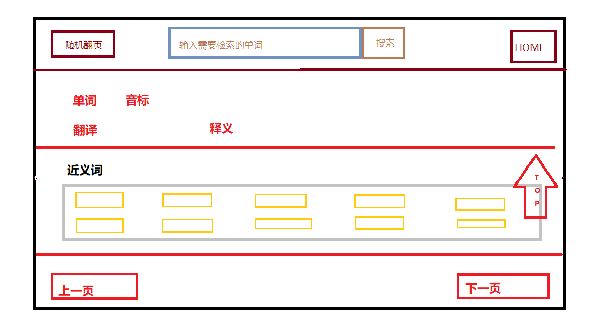

# 构建思路


我们现在有: 单词，单词的翻译，单词的近反义词（需要有超链接），单词的例句，单词的释义，单词的形近词(需要有超链接)，单词的音标。
word: 单词；translate: 翻译；homoionym: 近义词；antonym: 反义词；sentence: 例句；phonetic: 音标；similarity: 形近词；shiyi: 释义
```python
结构为{word:{"translate":String, "homoionym":List[List[String]], "antonym":List[List[String]], 
			"sentence":List[String], "phonetic":String, "similarity":List[String], "shiyi":String}}
```
草图模板


注意事项：
1. CSS与JS需要与html分离，不能写入到html文件里。
2. 注意给批量网页的写入标记插入点
## 批处理操作的网页
### 基本网页的制作（html部分）
随机单词 	内部搜索框(需要结合js来实现)		外部搜索框（调用搜词网站）		主页
<hr>
单词（h2）音标（strong）
中文意思(strong)
释义(strong)
<hr>

近义词(有超链接)
<li></li>	<li></li>	<li></li>	<li></li>
......

反义词(有超链接)
<li></li>	<li></li>	<li></li>	<li></li>
......

形近词(有超链接)
<li></li>	<li></li>	<li></li>	<li></li>
......

例句
1. 英文：
   翻译：
2. 英文：
   翻译：
   .......

上一页   随机翻页   主页   下一页
----------------------------------
超链接部分，如果鼠标悬浮在含有超链接部分的词汇上，则会显示该词汇的中文翻译。

### 网页的风格(CSS和JS部分)
#### 背景部分
```
方案一：使用动态轮播背景图片
方案二：清新背景图
方案三：网上的渐变背景
鼠标：实力允许可以改变鼠标形状
各个元素的位置处理
比如近反义词和形近词的单词可以一行四个
字体：可以修改成比较Q的字体。
```
实际解决方案：
1. 顶部实现动态云层变化
2. 每块区域有相应的背景图片
#### 功能部分
1. 上下滑动时，搜索框，home键和随机翻页会固定在页面中
2. 右边中部有一个动态蓝色旋转小球，也会固定在页面中，功能是实现回到顶部
3. 搜索框可以检索到考研单词的词汇，如果该单词不是考研单词里的词汇，则会跳转到外网搜索。
4. home键可以跳转到主页。
5. 随机翻页是基于js的动态翻页功能，这部分并不是静态的。


## 主页的操作

```
设计背景，与词汇页面相似。顶部设计和词汇页面一致。
一个主页有500个单词，所以会产生出11个主页。
一个主页里会分为5个块，每一块有100个单词。
每个块里的单词都是10*10的分布。
底部有页面的选择，可以直接跳转到你想要到的主页上。
```

## 代码部分
### table部分（index主页部分）

```
<h2>标题部分
// 这是页面数12
for page in range(1, 12):
	strings = """<div id="pos1">"""
	// 这是表数量table
	for table in range(5):
		trs = "<table>"
		// 这是行数量tr
		for tr in range(10):
			ths = "<tr>"
			// 这是列数量
			for th in range(10):
				ths += <th><a href="key.html" title="value">key</a></th>
			trs += ths
			trs += "</tr>"
		tables += trs
		tables += "</table>"
	strings += "</div>"
	if page == 1:
		left = """<a href="%s">上一页</a>""" %(11)
	else:
		left = """<a href="%s">上一页</a>""" %(page-1)
	right = """<a href="%s">下一页</a>""" %(page%11+1)
词汇部分的代码构思省略
```

# 遇上的问题及解决办法
## html部分
html网页的页面构图以及元素的使用
解决方法：画出网页的大概草图，主要使用div结构
## css部分
排版与一些页面特效
解决方法：
1. 学习div+css网页布局了解：marge padding display float clear postive等的作用
2. 搜索一些网上的css特效，进行部分的修改。
## js部分
```
随机翻页 搜索框以及home键的设计和实现
解决方法：
学习js基础，百度
搜索框的实现
解决思路：
先用python生成一个只包含word和translate键值对的json文件。
使用js将json文件导入，使用集合将dict的keys保存到set里
判断所搜索的单词是否在set里，如果有，直接返回网页， 没有就跳转到外网
随机翻页与搜索框的实现解决方法相似
```
## 使用代码批量保存网页
```
如何用python生成网页源代码
json数据的提取
解决方法：
分析源代码结构
```
